# POCKET OFFER

### Description

Pocket offer is a Smartphone Application to create offer documents. Each user can create their own dataset of clients and items. Created offers are stored and can be loaded for later editing.
Offer Documents are created in pdf, shows, in addition to the list of offer positions, the creation date, offer number, supplier's (=user) data, recipient's name and address, definable header and footer texts, and delivery time.
The application uses the API and the database setup of the backend-application "pocket-offer-backend" (https://github.com/Exulenood/pocket-offer-backend.git) for session management and data storage.

### Demo Video:
https://www.dropbox.com/s/31tea9kiylmpuxq/Demo_nonAudio.mp4?dl=0

### Features

- User Registration, Login, Logout
- Validation of API requests with Sessiontoken and a CSRF-Token, which changes on certain routes
- Storage of Sessiondata in device´s SecureStore
- Add and Delete clients (Name, Adress Data)
- Add and Delete template items (Own Id, Designation, Text, Cost, Sales Price )
- Add and Delete offer positions to the offers database (position id, item, optionality, quantity)
- Load previously created offers
- Create pdf-documents from created offer, containing the list of offer positions, the creation date, offer number, supplier's (=user) data, recipient's name and address, definable header and footer texts, and delivery time

### Technologies

- React Native
- Expo / Expo Router
- TypeScript
- JavaScript
- CSS

### Screenshots

#### Login Screen

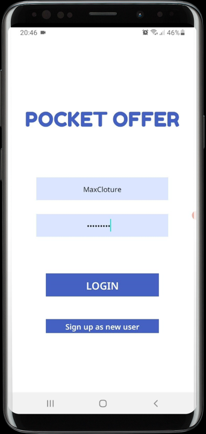

#### Home Screen

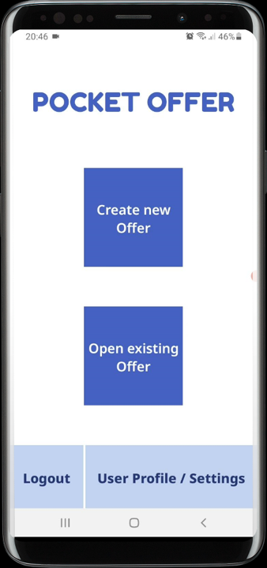

#### Offer Creation Screen

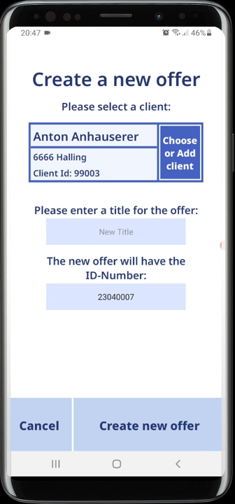

#### Select Client Screen

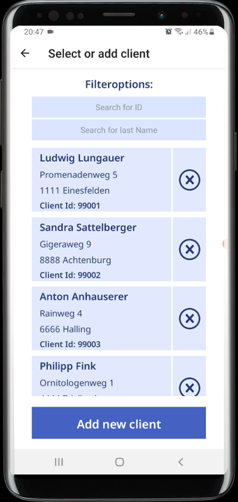

#### Add Client Screen

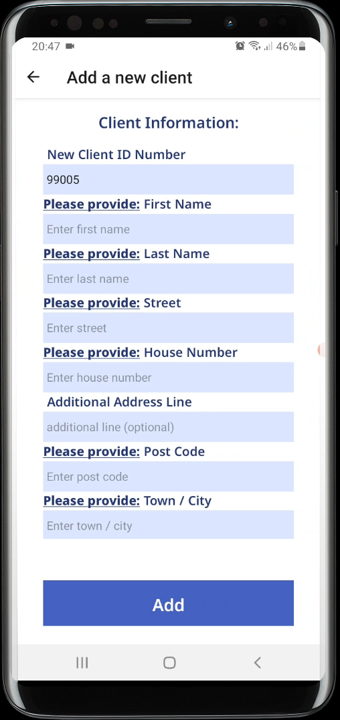

#### Main Offer Screen

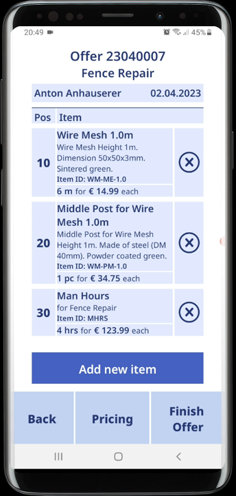

#### Add Item Screen

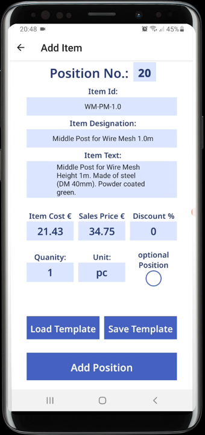

#### Item Templates Screen

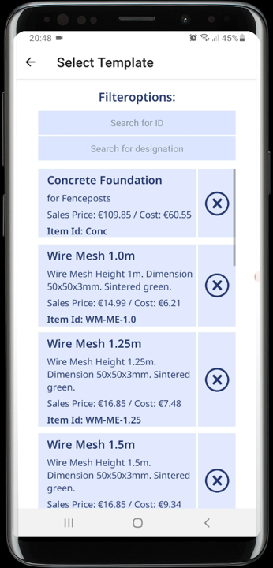

#### Finish Offer Screen

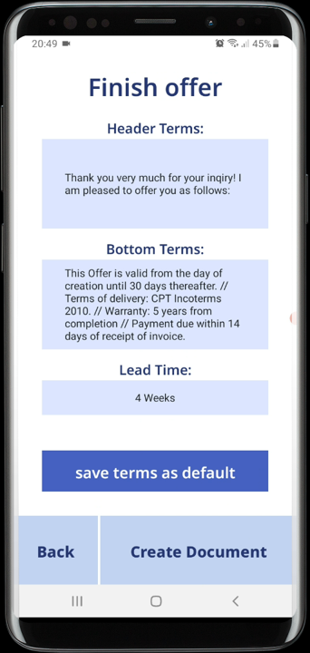

#### Existing Offer Screen

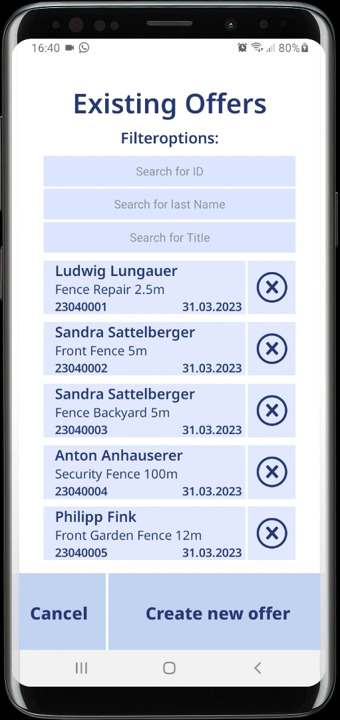

#### Created pdf

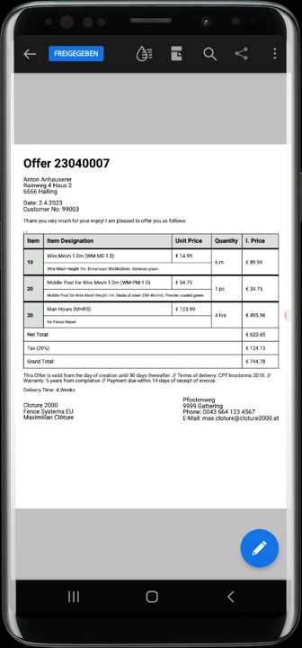
